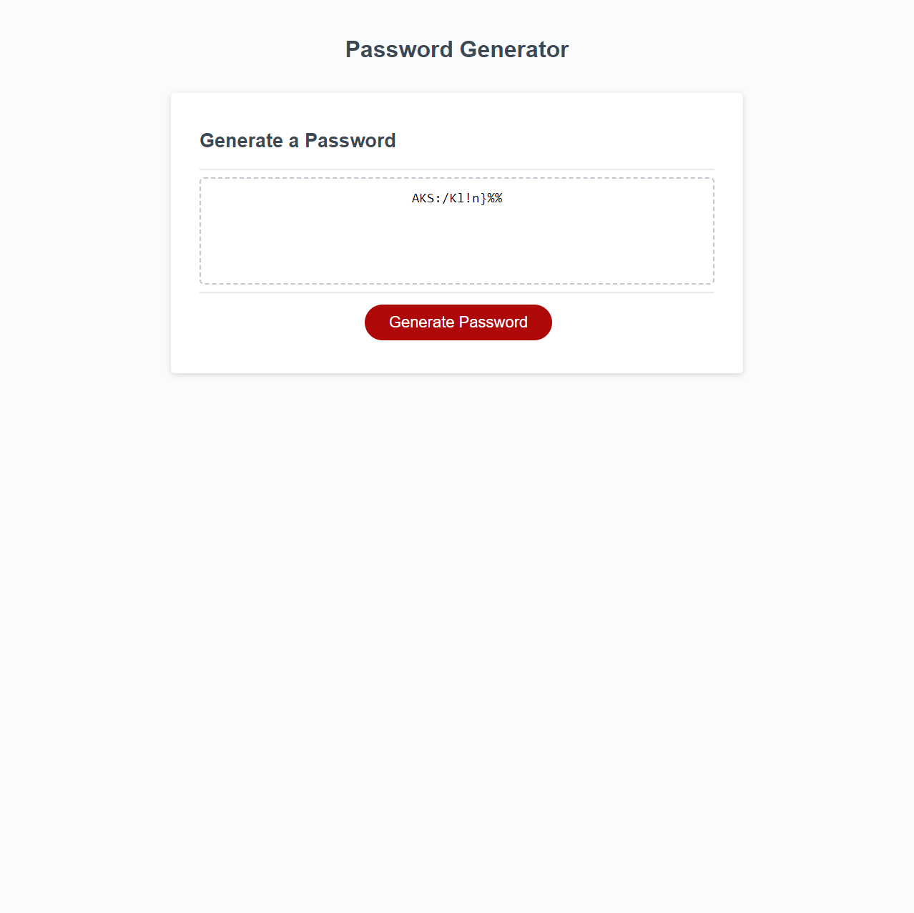

# Password-generator

## Description

This project showcases a random password generator built using JavaScript. It demonstrates my understanding and application of various JavaScript concepts such as `loops`, `objects`, `arrays`, and `functions`. The generator allows users to create secure passwords based on their chosen criteria, including length, and the inclusion of lowercase, uppercase, numeric, and special characters.

## Installation

N/A

## Usage

1. Visit the password generator website. (Link below)
2. On page load, follow the prompts to set your password preferences.
3. Choose your desired password length and whether to include lowercase, uppercase, numeric values, or special characters.
4. Click on the `Generate Password` button to receive your randomly generated password.

Link to the website: https://michaltrostowiecki.github.io/password-generator/

## Credits 

N/A

## License

This project is licensed under the MIT License - see the [LICENSE](LICENSE) file for details.
